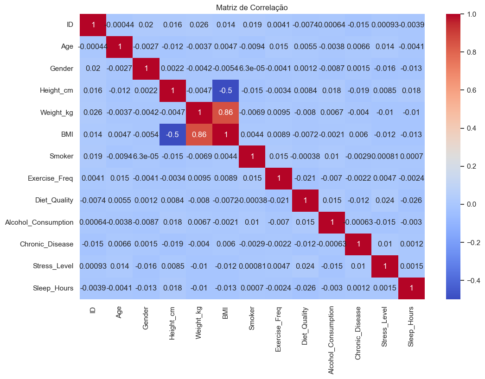
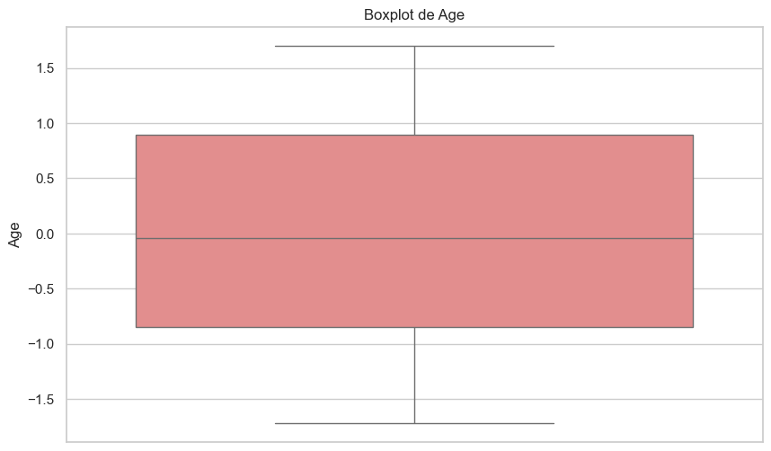
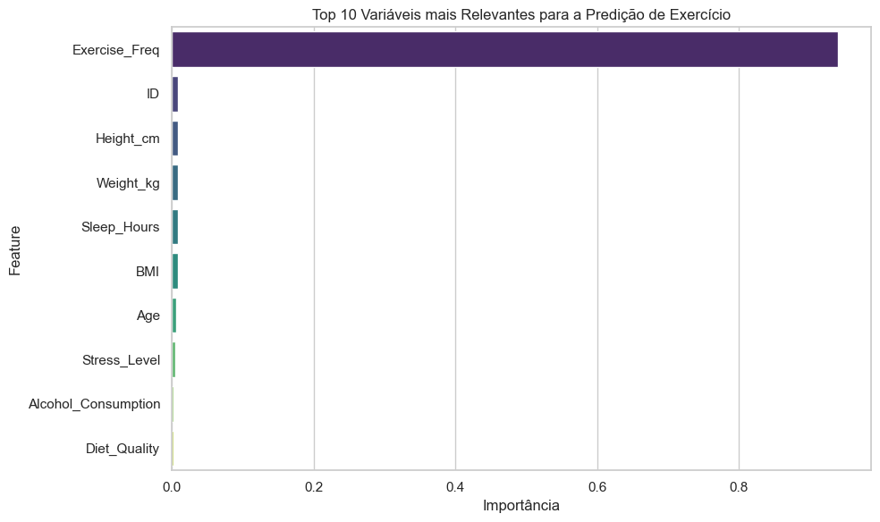

# Projeto de Data Science - Saúde e Estilo de Vida 🩺🍎

Este projeto foi desenvolvido como atividade final da disciplina de **Data Science – Princípios e Técnicas**.

## 📌 Objetivo

Analisar um conjunto de dados relacionados à saúde e estilo de vida, aplicando técnicas de:
- Limpeza e preparação de dados
- Análise exploratória (EDA)
- Modelagem preditiva
- Visualizações
- Documentação clara e acessível

## 📊 Dataset Utilizado

Health and Lifestyle Dataset: [Kaggle](https://www.kaggle.com/datasets/sahilislam007/health-and-lifestyle-dataset)

Este dataset inclui dados como idade, duração do sono, alimentação, tabagismo, consumo de álcool, entre outros fatores que impactam na saúde e estilo de vida das pessoas.

---

### 📘 Dicionário de Variáveis (Tradução)

| Nome da Coluna        | Significado em Português             |
|------------------------|--------------------------------------|
| `Exercise_Freq`        | Frequência de Exercício              |
| `Exercise_Cat`         | Categoria de Exercício (alvo criado)|
| `Smoking`              | Fuma?                                |
| `Sleep_Duration`       | Duração do sono                      |
| `Healthy_Eating`       | Alimentação saudável                 |
| `Alcohol_Consumption`  | Consumo de álcool                    |
| `Age`                  | Idade                                |
| `BMI`                  | Índice de Massa Corporal (IMC)       |

---

## 🧪 Técnicas Utilizadas

- Normalização e codificação de variáveis
- Conversão da variável `Exercise_Freq` em `Exercise_Cat` (com categorias discretas: nunca, às vezes, frequentemente)
- Estatísticas descritivas e gráficos
- Random Forest Classifier para prever quem tem maior frequência de exercícios
- Métrica de avaliação: F1-Score

---

## 📈 Visualizações

### 🔥 Heatmap de Correlação

### 📦 Boxplot de Coluna com Outliers

### 🌟 Top 10 Variáveis mais Relevantes

---

## 📁 Estrutura

- `data/`: Dataset original em CSV
- `notebooks/`: Notebook completo com análise e modelagem
- `models/`: (vazio) - não foi necessário salvar o modelo
- `img/`: Gráficos e imagens usadas no relatório
- `src/`: (vazio) - não houve necessidade de scripts externos
- `README.md`: Relatório técnico
- `requirements.txt`: Bibliotecas utilizadas

---

## 📽️ Apresentação

🎥 Link para o vídeo explicativo: [Vídeo](https://drive.google.com/file/d/1ynEkvjhWZgFq4gYQ9fF_m1V_c12YF7hP/view?usp=sharing)

---

## ✅ Resultado

A modelagem obteve bons resultados para previsão da frequência de exercícios, com base em características como alimentação, sono, idade, consumo de álcool e cigarro.

O uso do Random Forest permitiu interpretar as variáveis com maior influência na prática de atividades físicas.

---

## Conclusão

O projeto demonstrou o uso prático dos conceitos aprendidos na disciplina e reforçou o papel da ciência de dados como ferramenta de apoio à saúde e bem-estar.

---
Desenvolvido por Pérola 💜
